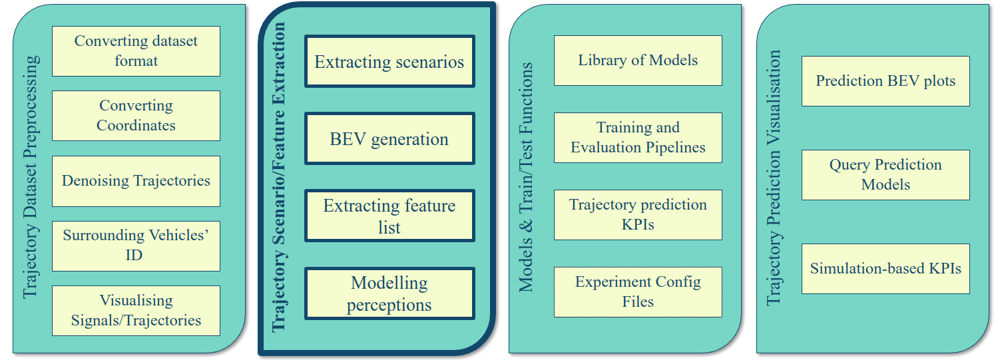

# Scenario and Feature Extraction for Vehicle Trajectory Datasets

This repo is part of Vehicle Trajectory Prediction Library (TPL): https://github.com/SajjadMzf/TPL



If you use any parts of this code, please cite us:
```
@article{mozaffari2023multimodal,
  title={Multimodal manoeuvre and trajectory prediction for automated driving on highways using transformer networks},
  author={Mozaffari, Sajjad and Sormoli, Mreza Alipour and Koufos, Konstantinos and Dianati, Mehrdad},
  journal={IEEE Robotics and Automation Letters},
  year={2023},
  publisher={IEEE}
}

@article{mozaffari2022early,
  title={Early lane change prediction for automated driving systems using multi-task attention-based convolutional neural networks},
  author={Mozaffari, Sajjad and Arnold, Eduardo and Dianati, Mehrdad and Fallah, Saber},
  journal={IEEE Transactions on Intelligent Vehicles},
  volume={7},
  number={3},
  pages={758--770},
  year={2022},
  publisher={IEEE}
}

```

## :gear: Installation
You may create a conda environment for this project using:
```shell
conda env create -f tpl.yml
```
## :wave: Intro
This repository extract scenarios and features from highway trajectory dataset (e.g., exid, highD, NGSIM datasets preprocessed using https://github.com/SajjadMzf/TrajPreprocess) required for training trajectory prediction models. Following are some pre-implemented scenarios/feature lists:

- Feature sets for several papers: MMNTP[1], POVL[2], EarlyLCPred [3], Wirthmuller et. al[4] and CS-LSTM[5].
- Time-to-lane-change calculation
- scenarios with labelled manouevres (lane change and lane keeping)
- Rendering bird's eye view images from extracted scenarios.
- Export datasets in hdf5 format.
- Support for multiple trajectory datasets (highD, exiD, NGSIM, and etc)


## :books: References:
1. Mozaffari, Sajjad, et al. "Multimodal manoeuvre and trajectory prediction for automated driving on highways using transformer networks." IEEE Robotics and Automation Letters (2023).

2. Mozaffari, Sajjad, et al. "Trajectory Prediction with Observations of Variable-Length for Motion Planning in Highway Merging scenarios." arXiv preprint arXiv:2306.05478 (2023).

3. Mozaffari, Sajjad, et al. "Early lane change prediction for automated driving systems using multi-task attention-based convolutional neural networks." IEEE Transactions on Intelligent Vehicles 7.3 (2022): 758-770.

4. Wirthmüller, Florian, et al. "Predicting the time until a vehicle changes the lane using LSTM-based recurrent neural networks." IEEE Robotics and Automation Letters 6.2 (2021): 2357-2364.

5.Deo, Nachiket, and Mohan M. Trivedi. "Convolutional social pooling for vehicle trajectory prediction." Proceedings of the IEEE conference on computer vision and pattern recognition workshops. 2018. 
